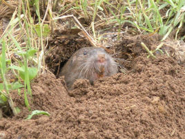

### 1、研发背景
Go语言官方自称,之所以开发go语言,是因为”近10年来的开发程序之难让我们有点沮丧（开发效率低，不适合团队开发）”，于是乎他们利用谷歌工程师的20%时间（谷歌允许员工抽出本职工作之外时间的20%来开发项目）开发了go语言。

### 2、研发人员
* Thompson：1983年图灵奖（Turing Award）和1998年美国国家技术奖（National Medal of Technology）得主。他与Dennis Ritchie是Unix的原创者。Thompson也发明了后来衍生出C语言的B程序语言。
* Pike：曾是贝尔实验室（Bell Labs）的Unix团队，和Plan 9操作系统计划的成员。他与Thompson共事多年，并共创出广泛使用的UTF-8 字元编码。
* Robert Griesemer：曾协助制作Java的HotSpot编译器，和Chrome浏览器的JavaScript引擎V8。
* 此外还有Plan 9开发者Russ Cox、和曾改善目前广泛使用之开原码编译器GCC的Ian Taylor。

### 3、发展历程
* 2007年，谷歌工程师Rob Pike, Ken Thompson和Robert Griesemer开始设计一门全新的语言，这是Go语言的最初原型。
* 2009年11月10日，Go语言以开放源代码的方式向全球发布。
* 2011年3月16日，Go语言的第一个稳定(stable)版本r56发布。
* 2012年3月28日，Go语言的第一个正式版本Go1发布。
* 2013年4月04日，Go语言的第一个Go 1.1beta1测试版发布。
* 2013年4月08日，Go语言的第二个Go 1.1beta2测试版发布。
* 2013年5月02日，Go语言Go 1.1RC1版发布。
* 2013年5月07日，Go语言Go 1.1RC2版发布。
* 2013年5月09日，Go语言Go 1.1RC3版发布。
* 2013年5月13日，Go语言Go 1.1正式版发布。
* 2013年9月20日，Go语言Go 1.2RC1版发布。
* 2013年12月1日，Go语言Go 1.2正式版发布。
* 2014年6月18日，Go语言Go 1.3版发布。
* 2014年12月10日，Go语言Go 1.4版发布。
* 2015年8月19日，Go语言Go 1.5版发布，本次更新中移除了”最后残余的C代码”。
* 2016年2月17日，Go语言Go 1.6版发布。
* 2016年8月15日，Go语言Go 1.7版发布。
* 2017年2月17日，Go语言Go 1.8版发布。
* 2017年8月24日，Go语言Go 1.9版发布。
* 2018年2月16日，Go语言Go 1.10版发布。
* 2018年8月24日，Go语言Go 1.11版发布。

### 4、Logo和吉祥物
#### logo:

#### 吉祥物:

### 5、gopher的含义
gopher是一种生活在加拿大的小动物，go的吉祥物就是这个小动物， 它的中文名叫做
[囊地鼠](https://baike.baidu.com/item/%E5%9B%8A%E5%9C%B0%E9%BC%A0/7633156?fr=aladdin),
这种动物有个特点就是生活在底下，哈哈，当然这个不是最关键的，他们最大的特点就是挖洞速度特别快，当然
可能不止是挖洞啦。笔者猜测go之所以叫go,是想表达这门语言的运行速度、开发速度、学习速度（develop）都像gopher一样快。 
&nbsp;

---

作者：xmge 
链接：[golang专题讲解-golang发展历史](https://github.com/xmge/gonote/blob/master/golang%E4%B8%93%E9%A2%98%E8%AE%B2%E8%A7%A3/golang%E5%8F%91%E5%B1%95%E5%8E%86%E5%8F%B2.md) 
来源：github 
著作权归作者所有。商业转载请联系作者获得授权，非商业转载请注明出处。
